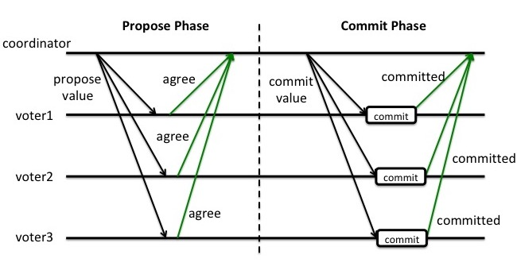

# Raichu -- Distributed Key-Value Storage System

## System Environment

- Ubuntu18.04
- Zookeeper-3.4.13 (3 nodes on 1 machine)
- grpc

## Configuration

### Zookeeper Cluster Install & Configuration

#### 1. Zookeeper Cluster Install

```shell
#!/bin/sh

# install the running environment of zk
sudo apt-get install openjdk-8-jre

# download zk
wget https://archive.apache.org/dist/zookeeper/zookeeper-3.4.13/zookeeper-3.4.13.tar.gz

# unzip zk
tar -xvf zookeeper-3.4.13.tar.gz

# move the zk dir to the directed dir
sudo mv zookeeper-3.4.13 /usr/local/zookeeper/zookeeper-3.4.13

# create the soft link to zk dir
sudo ln -s /usr/local/zookeeper/zookeeper-3.4.13 /usr/local/zookeeper/apache-zookeeper

# add two more nodes
cp -rf /usr/local/zookeeper/zookeeper-3.4.13   /usr/local/zookeeper/zookeeper-node2
cp -rf /usr/local/zookeeper/zookeeper-3.4.13   /usr/local/zookeeper/zookeeper-node3
```

#### 2. Modify Env Path

```shell
vim /etc/profile
```

Add these two lines.

```
export ZK_HOME=/usr/local/zookeeper/apache-zookeeper
export PATH=$ZK_HOME/bin:$PATH
```

Then

```shell
source /etc/profile
```

#### 3. Modify zoo.cfg

```shell
cd /usr/local/zookeeper/apache-zookeeper/conf
cp zoo_sample.cfg zoo.cfg
vim zoo.cfg
```

Node1

```shell
#zookeeper时间单元，单位为毫秒
tickTime=2000
#集群中的follower服务器(F)与leader服务器(L)之间 初始连接 时能容忍的最多心跳数（tickTime的数量）。
initLimit=10
# 集群中的follower服务器(F)与leader服务器(L)之间 请求和应答 之间能容忍的最多心跳数（tickTime的数量）。
syncLimit=5
# data数据目录
dataDir=/usr/local/zookeeper/zookeeper-3.4.13/data
# 客户端连接端口
clientPort=2181
# 客户端最大连接数
#maxClientCnxns=60
# 需要保留的快照数目
#autopurge.snapRetainCount=3
# 是否开启自动清理事务日志和快照功能 0 不开启，1表示开启
#autopurge.purgeInterval=1
#集群配置 
server.1=127.0.0.1:2888:3888
server.2=127.0.0.1:2889:3889
server.3=127.0.0.1:2890:3890
```

Node2

```shell
#zookeeper时间单元，单位为毫秒
tickTime=2000
#集群中的follower服务器(F)与leader服务器(L)之间 初始连接 时能容忍的最多心跳数（tickTime的数量）。
initLimit=10
# 集群中的follower服务器(F)与leader服务器(L)之间 请求和应答 之间能容忍的最多心跳数（tickTime的数量）。
syncLimit=5
# data数据目录
dataDir=/usr/local/zookeeper/zookeeper-node2/data
# 客户端连接端口
clientPort=2182
# 客户端最大连接数
#maxClientCnxns=60
# 需要保留的快照数目
#autopurge.snapRetainCount=3
# 是否开启自动清理事务日志和快照功能 0 不开启，1表示开启
#autopurge.purgeInterval=1
#集群配置 
server.1=127.0.0.1:2888:3888
server.2=127.0.0.1:2889:3889
server.3=127.0.0.1:2890:3890
```

Node3

```shell
#zookeeper时间单元，单位为毫秒
tickTime=2000
#集群中的follower服务器(F)与leader服务器(L)之间 初始连接 时能容忍的最多心跳数（tickTime的数量）。
initLimit=10
# 集群中的follower服务器(F)与leader服务器(L)之间 请求和应答 之间能容忍的最多心跳数（tickTime的数量）。
syncLimit=5
# data数据目录
dataDir=//usr/local/zookeeper/zookeeper-node3/data
# 客户端连接端口
clientPort=2183
# 客户端最大连接数
#maxClientCnxns=60
# 需要保留的快照数目
#autopurge.snapRetainCount=3
# 是否开启自动清理事务日志和快照功能 0 不开启，1表示开启
#autopurge.purgeInterval=1
#集群配置 
server.1=127.0.0.1:2888:3888
server.2=127.0.0.1:2889:3889
server.3=127.0.0.1:2890:3890
```

#### 4. ZK-run.sh

```shell
#!/bin/bash

# run node1
cd /usr/local/zookeeper/zookeeper-3.4.13/bin
sudo ./zkServer.sh start

# run node2
cd /usr/local/zookeeper/zookeeper-node2/bin
sudo ./zkServer.sh start

# run node3
cd /usr/local/zookeeper/zookeeper-node3/bin
sudo ./zkServer.sh start

# show state
cd /usr/local/zookeeper/zookeeper-3.4.13/bin
./zkServer.sh status 
cd /usr/local/zookeeper/zookeeper-node2/bin
./zkServer.sh status 
cd /usr/local/zookeeper/zookeeper-node3/bin
./zkServer.sh status 
```

#### 5. C API Install

```shell
cd /usr/local/zookeeper/apache-zookeeper/src/c
make CFLAGS=-Wno-error=format-overflow 
sudo make install
sudo ldconfig
```

### Zk-CPP-Client

> As if you want to access zookeeper, the client interface of c/cpp is necessary. At the beginning, I tried to use the interface of zk's C language version, but later found it more difficult to use, and then found it on GitHub, and find a cpp implementation version. By encapsulating the interfaces of c with the cpp class, I kept some of the more commonly used interfaces for this assignment.

#### 1. Some useful interfaces

- Create

```cpp
	zoo_rc      create_persistent_node(const char* path, const std::string& value, const std::vector<zoo_acl_t>& acl);
	zoo_rc      create_sequence_node(const char* path, const std::string& value, const std::vector<zoo_acl_t>& acl, std::string& returned_path_name);
	zoo_rc      create_ephemeral_node(const char* path, const std::string& value, const std::vector<zoo_acl_t>& acl);
	zoo_rc      create_sequance_ephemeral_node(const char* path, const std::string& value, const std::vector<zoo_acl_t>& acl, std::string& returned_path_name);
```

- Set

```cpp
 	zoo_rc      set_node(const char* path, const std::string& value, int32_t version);
```

- Get

```cpp
 	zoo_rc      get_node(const char* path, std::string& out_value, zoo_state_t* info, bool watch);
```

- Get_children

```cpp
	zoo_rc      get_children(const char* path, std::vector<std::string>& children, bool watch);
```

- Delete

```cpp
	zoo_rc      delete_node(const char* path, int32_t version);
```

- Exist

```cpp
	zoo_rc      exists_node(const char* path, zoo_state_t* info, bool watch);
```

- Set_acl

```cpp
	zoo_rc      set_acl(const char* path, const std::vector<zoo_acl_t>& acl, int32_t version);
```

- Get_acl

```cpp
	zoo_rc      get_acl(const char* path, std::vector<zoo_acl_t>& acl);
```

- Add_auth

```cpp
	zoo_rc      add_auth(const std::string& user_name, const std::string& user_passwd);
```

#### 2. Some call-back functions

- Call-back function for node data change

```cpp
	zoo_rc      watch_data_change(const char* path, const data_change_event_handler_t& handler, std::string* value);
```

- Call-back function for node's children management

```cpp
	zoo_rc      watch_children_event(const char* path, const child_event_handler_t& handler, std::vector<std::string>* out_children );
```


### RPC Configuration

> I firstly used the rpc implementation of WeChat, called `phxrpc`. Later I found that this is a layer  of encapsulation on grpc, and the function is a bit redundant for me. It is cumbersome to use and it is better to use grpc directly. So grpc was used in the end.

#### rpc.proto

```protobuf
// Copyright 2015 gRPC authors.
//
// Licensed under the Apache License, Version 2.0 (the "License");
// you may not use this file except in compliance with the License.
// You may obtain a copy of the License at
//
//     http://www.apache.org/licenses/LICENSE-2.0
//
// Unless required by applicable law or agreed to in writing, software
// distributed under the License is distributed on an "AS IS" BASIS,
// WITHOUT WARRANTIES OR CONDITIONS OF ANY KIND, either express or implied.
// See the License for the specific language governing permissions and
// limitations under the License.

syntax = "proto3";

option java_multiple_files = true;
option java_package = "io.grpc.examples.rpc";
option java_outer_classname = "rpcProto";
option objc_class_prefix = "HLW";

package rpc;

// The kv client service definition
service KV{
  // ask master for the datanode address
  rpc Where (KVRequest) returns (KVResponse) {}
  // datanode operations
  rpc Read (KVRequest) returns (KVResponse) {}
  rpc Put (KVRequest) returns (KVResponse) {}
  rpc Delete (KVRequest) returns (KVResponse) {}
}

message KVRequest {
  string key = 1;
  string value = 2;
}

message KVResponse {
  string message = 1;
}
```

## System Implementation

### System Design


### Node Explanation

- **Client**: The system allows multiple clients to access the system, and each client can perform `Read`, `Put`, and `Delete` operations on the database. Concurrency control is guaranteed by `ReadWriteLock` based on `Zookeeper`.
- **Master**: The master node does not store substantial key-value pair information, and uses `zookeeper` to store the `metadata` of the two `datanodes`. When the client sends a request for key-value pairs, it firstly asks which datanode the master node should operate on, and then connects to the datanode for operation.
- **Datanode**: The storage of the data node uses the `2PC protocol`. The datanode serves as the `Coordinator` and does not store the actual data. It is mainly used to coordinate all backups and select the primary node.
- **Primary/Backup**: `Backup` is the node that actually stores the key-value pair information, and `Primary` is the node that the `Coordinator` selects from the backup when performing the `read` operation.

### Support Operations


### Details

#### 2PC ( Two-Phase Commit )




Coordinator will abort this operation if any backup refuse at `propose phase`. Then it will ask all backups to do the transaction and commit.

#### ReadWriteLock

##### 1. How to define the lock node:

A lock is represented by the data node on zookeeper, for example: `/lock/request type-sequence number`. This node is a temporary node, and the subsequent sequence number is generated by the zookeeper sequence, which represents the globally unique sequence of the zookeeper node. For example, `/lock/READ-00000001` indicates a read-type distributed lock. The zookeeper node structure is as follows:


##### 2. How to acquire the lock:

When acquiring the lock, the client creates a temporary sequence node under the `/lock` node. If it is a read, it creates a temporary sequence node in the form of `/lock/READ-`, and then zookeeper will return a complete node in the form of `/lock /READ-00000002` is a temporary node with a sequence number, this node represents the lock you are about to acquire.

##### 3. Determine whether to get the lock:

- If it is a write lock:
  - Get child nodes under /lock
  - Sort by order number
  - Check if there are other locks before this write lock. If you have registered to monitor the lock before the write lock, then block the write lock acquisition, if the lock is released before listening to the write lock, the write lock opens the block .
- If it is a read lock:
  - Get child nodes under /lock
  - Sort by order number
  - Check if there is a write lock before this read lock. If there is any registration of the previous write lock of the read lock, then block the read lock acquisition. If a write lock is released before the read lock is monitored, the read lock is blocked.

##### 4. Code

Lock.h

```cpp
#pragma once

#include "../server/utils/zk/zk_cpp.h"
#include <mutex>
#include <condition_variable>

namespace raichu
{
    namespace lock
    {
        // Simple CountDownLatch Implementation
        class CountDownLatch
        {
        private:
            std::mutex m_mutex;
            std::condition_variable m_cv;
            unsigned int m_count = 0;

        public:
            explicit CountDownLatch(const unsigned int count) : m_count(count) {}

            void await(void);
            void countDown(void);
            unsigned int getCount(void);
        };

        class ReadWriteLock
        {
        private:
            raichu::server::zk::zk_cpp zk_client;
            std::string lock_name;
            std::string read_lock;
            std::string write_lock;

            enum LockType
            {
                Read = 0,
                Write
            };

            inline bool matchLockType(const std::string &path, LockType locktype);

        public:
            explicit ReadWriteLock(const std::string &host_name, const std::string &lock_name) : lock_name(lock_name)
            {
                zk_client.connect(host_name);
                if (zk_client.exists_node(lock_name.c_str(), nullptr, true) != raichu::server::zk::z_ok)
                {
                    std::vector<raichu::server::zk::zoo_acl_t> acl;
                    acl.push_back(raichu::server::zk::zk_cpp::create_world_acl(raichu::server::zk::zoo_perm_all));
                    zk_client.create_persistent_node(lock_name.c_str(), "0", acl);
                }
            }

            void sortNode(std::vector<std::string> &vec);

            // get read lock
            void lockRead();

            // release read lock
            void unLockRead();

            // get write lock
            void lockWrite();

            // release write lock
            void unLockWrite();
        };
    } // namespace lock
} // namespace raichu
```

Lock.cpp

```cpp
#include "lock.h"
#include <algorithm>

namespace raichu
{
    namespace lock
    {
        // Simple CountDownLatch Implementation
        void CountDownLatch::await(void)
        {
            std::unique_lock<std::mutex> lock(m_mutex);
            if (m_count > 0)
            {
                m_cv.wait(lock, [this]() { return m_count == 0; });
            }
        }

        void CountDownLatch::countDown(void)
        {
            std::unique_lock<std::mutex> lock(m_mutex);
            if (m_count > 0)
            {
                m_count--;
                m_cv.notify_all();
            }
        }

        unsigned int CountDownLatch::getCount(void)
        {
            std::unique_lock<std::mutex> lock(m_mutex);
            return m_count;
        }

        // sort via sequence
        void ReadWriteLock::sortNode(std::vector<std::string> &vec)
        {

            std::sort(vec.begin(), vec.end(), [](std::string &s1, std::string &s2) {
                return std::stoi(s1.substr(s1.find("-") + 1)) < std::stoi(s2.substr(s2.find("-") + 1));
            });
        }

        inline bool ReadWriteLock::matchLockType(const std::string &path, LockType locktype)
        {
            return path.substr(path.find("-") + 1)[0] == std::to_string(locktype)[0];
        }

        // get read lock
        void ReadWriteLock::lockRead()
        {
            std::unique_ptr<CountDownLatch> readlatch(new CountDownLatch(1));
            // create sequance ephemeral node
            std::string nodename_prefix = lock_name + "/" + std::to_string(LockType::Read) + "-";
            std::vector<raichu::server::zk::zoo_acl_t> acl;
            acl.push_back(raichu::server::zk::zk_cpp::create_world_acl(raichu::server::zk::zoo_perm_all));
            zk_client.create_sequance_ephemeral_node(nodename_prefix.c_str(), "0", acl, this->read_lock);

            // find the write_lock before this lock
            std::vector<std::string> all_locks;
            zk_client.get_children(lock_name.c_str(), all_locks, true);
            sortNode(all_locks);

            int size = all_locks.size();
            int tmp_index = 0;
            for (int i = size - 1; i >= 0; i--)
            {
                if (lock_name + "/" + all_locks[i] == this->read_lock)
                {
                    tmp_index = i;
                }
                else if (i < tmp_index && matchLockType(all_locks[i], LockType::Write))
                {
                    std::string write_node_path = lock_name + "/" + all_locks[i];
                    // child change events
                    auto child_change_events = [this, &readlatch, &write_node_path](const std::string &path, const std::vector<std::string> &children) {
                        if (this->zk_client.exists_node(write_node_path.c_str(), nullptr, true) == raichu::server::zk::z_ok)
                        {
                            readlatch->countDown();
                        }
                    };
                    zk_client.watch_children_event(lock_name.c_str(), child_change_events, &all_locks);

                    readlatch->await();

                    break;
                }
            }
        }

        // release read lock
        void ReadWriteLock::unLockRead()
        {
            if (this->read_lock != "")
            {
                zk_client.delete_node(this->read_lock.c_str(), -1);
                this->read_lock = "";
            }
        }

        // get write lock
        void ReadWriteLock::lockWrite()
        {
            std::unique_ptr<CountDownLatch> writelatch(new CountDownLatch(1));
            // create sequance ephemeral node
            std::string nodename_prefix = lock_name + "/" + std::to_string(LockType::Write) + "-";
            std::vector<raichu::server::zk::zoo_acl_t> acl;
            acl.push_back(raichu::server::zk::zk_cpp::create_world_acl(raichu::server::zk::zoo_perm_all));
            zk_client.create_sequance_ephemeral_node(nodename_prefix.c_str(), "0", acl, this->write_lock);

            // get all locks
            std::vector<std::string> all_locks;
            zk_client.get_children(lock_name.c_str(), all_locks, true);
            sortNode(all_locks);

            int size = all_locks.size();
            for (int i = size - 1; i >= 0; i--)
            {
                // find this writelock in the list
                if (this->write_lock == lock_name + "/" + all_locks[i])
                {
                    // there is still some locks before this writelock, then wait
                    if (i > 0)
                    {
                        auto child_change_events = [this, &writelatch](const std::string &path, const std::vector<std::string> &children) {
                            if (lock_name + "/" + children[0] == this->write_lock)
                            {
                                writelatch->countDown();
                            }
                        };

                        zk_client.watch_children_event(lock_name.c_str(), child_change_events, &all_locks);

                        writelatch->await();
                        break;
                    }
                }
            }
        }

        // release write lock
        void ReadWriteLock::unLockWrite()
        {
            if (this->write_lock != "")
            {
                zk_client.delete_node(this->write_lock.c_str(), -1);
                this->write_lock = "";
            }
        }
    } // namespace lock
} // namespace raichu
```

#### Consistent Hashing

##### 1. Introduction

It is a hash algorithm for distributed system. You can find its introduction at 

[here]: https://zhuanlan.zhihu.com/p/34985026


##### 2.Code

Cosistent-hash.h

```cpp
#pragma once

#include <map>
#include <string>
#include <list>
#include <functional>
#include <algorithm>

namespace raichu
{
    namespace hash
    {
        template <typename T,
                  typename Hash,
                  typename Alloc = std::allocator<std::pair<const typename Hash::result_type, T>>>
        class consistent_hash_map
        {
        public:
            using size_type = typename Hash::result_type;
            using map_type = std::map<size_type, T, std::less<size_type>, Alloc>;
            using value_type = typename map_type::value_type;
            using reference = value_type &;
            using const_reference = const value_type &;
            using iterator = typename map_type::iterator;
            using reverse_iterator = typename map_type::reverse_iterator;
            using allocator_type = Alloc;

        public:
            consistent_hash_map() {}

        public:
            std::size_t size() const
            {
                return nodes_.size();
            }

            bool empty() const
            {
                return nodes_.empty();
            }

            std::pair<iterator, bool> insert(const T &node)
            {
                size_type hash = hasher_(node);
                return nodes_.insert(value_type(hash, node));
            }

            void erase(iterator it)
            {
                nodes_.erase(it);
            }

            std::size_t erase(const T &node)
            {
                size_type hash = hasher_(node);
                return nodes_.erase(hash);
            }

            iterator find(size_type hash)
            {
                if (nodes_.empty())
                {
                    return nodes_.end();
                }

                iterator it = nodes_.lower_bound(hash);

                if (it == nodes_.end())
                {
                    it = nodes_.begin();
                }

                return it;
            }

            iterator begin() { return nodes_.begin(); }
            iterator end() { return nodes_.end(); }
            reverse_iterator rbegin() { return nodes_.rbegin(); }
            reverse_iterator rend() { return nodes_.rend(); }

        private:
            Hash hasher_;
            map_type nodes_;
        };
    } // namespace hash
} // namespace raichu

```

Test.cpp

```cpp
#include <stdint.h>
#include <iostream>
#include <string>
#include <boost/functional/hash.hpp>
#include <boost/format.hpp>
#include <boost/crc.hpp>

#include "consistent-hash.h"

const char *nodes[] = {
    "localhost:50051",
    "localhost:50053"};

struct vnode_t
{
    vnode_t() {}
    vnode_t(std::size_t n, std::size_t v) : node_id(n), vnode_id(v) {}

    std::string to_str() const
    {
        return boost::str(boost::format("%1%-%2%") % nodes[node_id] % vnode_id);
    }

    std::size_t node_id;
    std::size_t vnode_id;
};

struct crc32_hasher
{
    uint32_t operator()(const vnode_t &node)
    {
        boost::crc_32_type ret;
        std::string vnode = node.to_str();
        std::cout << "vnode:" << vnode << std::endl;
        ret.process_bytes(vnode.c_str(), vnode.size());
        return ret.checksum();
    }
    typedef uint32_t result_type;
};

int main(int argc, char const *argv[])
{
    using consistent_hash_t = raichu::hash::consistent_hash_map<vnode_t, crc32_hasher>;
    consistent_hash_t consistent_hash_;

    for (std::size_t i = 0; i < 5; ++i)
    {
        for (std::size_t j = 0; j < 100; j++)
        {
            consistent_hash_.insert(vnode_t(i, j));
        }
    }

    {
        std::cout << "=========================================================" << std::endl;
        std::size_t sums[] = {0, 0, 0, 0, 0};
        consistent_hash_t::iterator i = consistent_hash_.begin();
        consistent_hash_t::reverse_iterator j = consistent_hash_.rbegin();
        std::size_t n = i->first + UINT32_MAX - j->first;
        std::cout << boost::format("vnode:%1%,hash:%2%,contains:%3%") % i->second.to_str() % i->first % n << std::endl;
        sums[i->second.node_id] += n;

        uint32_t priv = i->first;
        uint32_t cur;
        consistent_hash_t::iterator end = consistent_hash_.end();
        while (++i != end)
        {
            cur = i->first;
            n = cur - priv;
            std::cout << boost::format("vnode:%1%,hash:%2%,contains:%3%") % i->second.to_str() % cur % n << std::endl;
            sums[i->second.node_id] += n;
            priv = cur;
        }

        for (std::size_t i = 0; i < 5; ++i)
        {
            std::cout << boost::format("node:%1% contains:%2%") % nodes[i] % sums[i] << std::endl;
        }
    }

    {
        consistent_hash_t::iterator it;
        it = consistent_hash_.find(290235110);
        std::cout << boost::format("node:%1%,vnode:%2%,hash:%3%") % nodes[it->second.node_id] % it->second.vnode_id % it->first << std::endl;
    }

    return 0;
}
```

